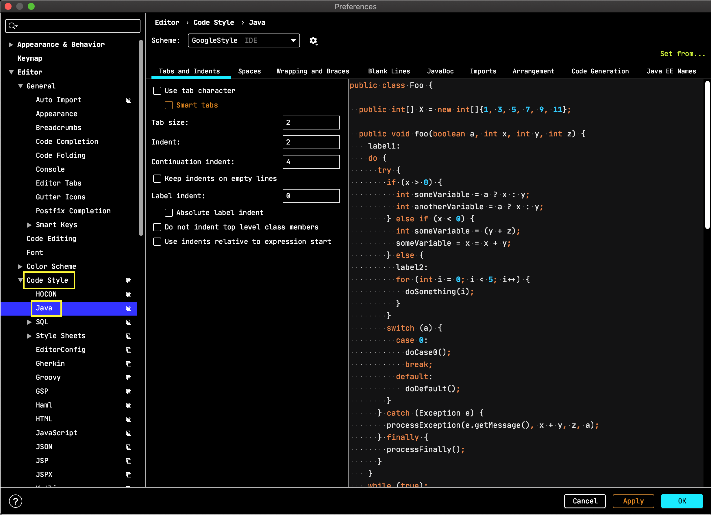
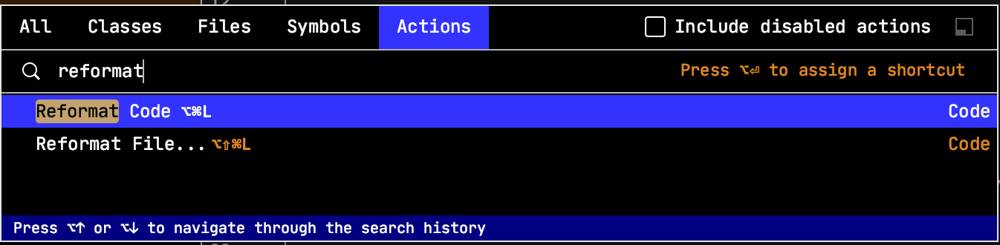

# Recipe 1: Format code using IntelliJ Idea and .editorconfig

## Description

  It is always important to comply with the best practices and code styles.

  Moreover the ability to share the
  common format configuration between developers is almost a must have for the code quality.

  .editorconfig is a trend in terms of code formatting/style, and Jetbrains team brings this to a new level to stay close to their `Develop with pleasure` motto.

## Receipt

  Configure the .editorconfig in IntelliJ Idea.

  > Besides the built-in .editorconfig formatting rules, IntelliJ Idea (2019.2+) provides additional ones, corresponding to the ones existent in this IDE.
  >
  > Moreover .editorconfig files could be arranged hierarchically so that some rules might be overridden in a particular folder.

## Context (prerequisites)

- IntelliJ Idea 2019.2+

## Benefits

- apart for the common editorconfig rules,

- IntelliJ Idea support for .editorconfig go further and allows to (practically) configure every single Idea editor code style rules, those that can be seen in the Idea `Preferences | Editor | Code Style | Java` and image below.

  

- and through Idea reformat code action and idea intentions all wrongly formatted files could be addressed extremely easily

- and, moreover, share the .editorconfig file in VCS (git) so that whoever works on the project use the same formatting rules.

## Steps

  - create a new .editorconfig file in the project root, using `File | New | EditorConfig file` menu item.

  

  - in the dialog select the ij specific rules (as comments) for specific languages/file types.

  

  - check the .editorconfig changes using the preview `using the eye in the editor gutter`.

  

  - after selecting a file as a target of the editor config preview, the editorconfig file is split with the target in the editor.

  

  > Idea automatically configure its code formatting support based on the existing .editorconfig file.
  >
  > We can check if .editorconfig is enabled in Idea by getting to the Idea `Preferences | Editor | Code Style`.

  

  > Idea show the support it is using for the current open file in (the right hand side of) the status bar.

  

## Take away

Through .editorconfig improved  support in IntelliJ idea developers can benefit from:
  - working with the wellknown code style (formatting) tool - .editorconfig
  - and furthermore take advantages of all Idea code style rules, actions and intentions.
  - and have all this configuration auto-discovered by IntelliJ idea (no extra configuration on our side to benefit from a shared well setup .editorconfig)

Get the code well formatted just hit `Find action` or `ctrl-shift-a` and choose as can be seen below.

## References

  - [code style in IntelliJ Idea 2019.2 with .editorconfig](https://blog.jetbrains.com/idea/2019/06/managing-code-style-on-a-directory-level-with-editorconfig/)
