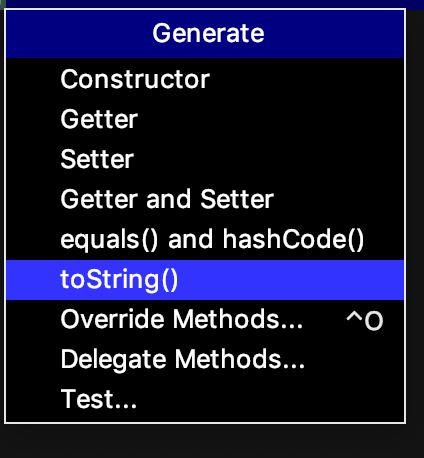
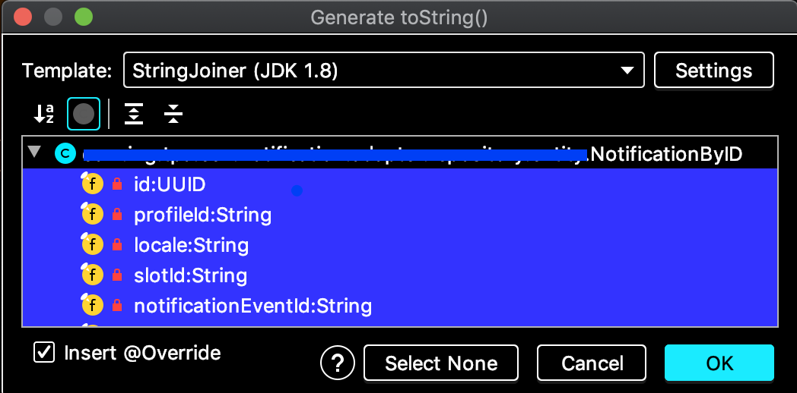
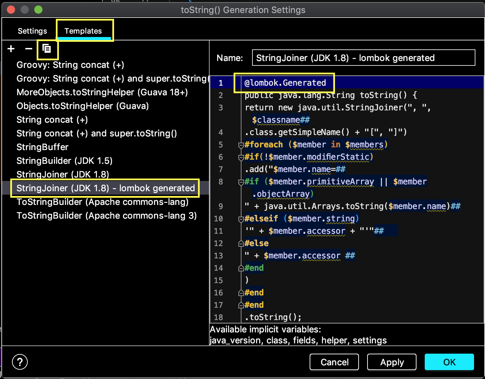
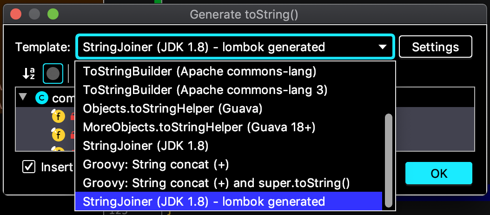
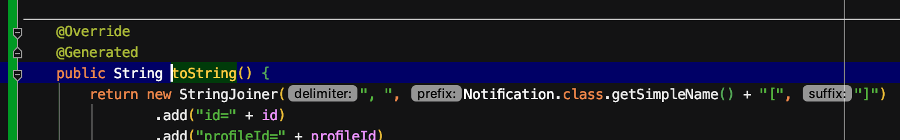

# Recipe 1: Code coverage with the “ignorant” jacoco

## Description

Jacoco code coverage tool for java application definitely has to be included (through Jenkins and SonarQube) in the CI/CD pipeline of every production projects.

It is lightweight, flexible and (quite) documented.

It is supported by major java project management tools such as maven and ant.
Through the maven plugin jacoco is extremely flexible, allowing to ignore java files and to set up thresholds/limits for code quality.

By maven jacoco plugin configuration the CI pipeline fails when these limits passed. This leads to a high code quality through a significant test code coverage.

On the other hand SonarQube integrates the jacoco tool (amongst other quality tools) through plugins, and provides a good overview of the project quality.

## Receipt

<span style='color:magenta'>__Exclude code from jacoco coverage for__

- methods (constructors) of POJO (Java beans) generated by lombok
- methods (i.e. toString) generated by IntelliJ Idea

## Context

Conducting  a small but important simplification in a java/maven project codebase.

One of the improvements is about migration of dummy POJOs (Java beans) generated by  the IntelliJ Idea to the ones generated by lombok.

The code coverage of the project was above the 75% threshold.

Jacoco maven plugin is configured as per below.

```xml
<plugin>
  <groupId>org.jacoco</groupId>
  <artifactId>jacoco-maven-plugin</artifactId>
  <version>0.8.2</version>
  <configuration>
    <excludes>
      <exclude>ro/jtonic/**/avro/domain/*</exclude>
      <exclude>ro/jtonic/**/*Exception.class</exclude>
    </excludes>
  </configuration>
  <executions>
    <execution>
      <id>default-prepare-agent</id>
      <goals>
        <goal>prepare-agent</goal>
      </goals>
    </execution>
    <execution>
      <id>default-report</id>
      <phase>prepare-package</phase>
      <goals>
        <goal>report</goal>
      </goals>
    </execution>
  </executions>
</plugin>
```

## Benefits

<span style='color:magenta'>__Code simplification with lombok__
1. less (both production and test) code,
1. more maintainable code,
1. keep or improve the code coverage without a single additional line of unit tests.

## Steps

1. Configure lombok in maven pom.xml

    ```xml

   <!-- in dependencies -->
    <dependency>
      <groupId>org.projectlombok</groupId>
      <artifactId>lombok</artifactId>
      <version>1.18.10</version>
      <scope>provided</scope>
    </dependency>

    <!-- in build/plugins -->
    <plugin>
     <groupId>org.apache.maven.plugins</groupId>
     <artifactId>maven-compiler-plugin</artifactId>
     <version>3.8.1</version>
     <configuration>
       <annotationProcessorPaths>
         <path>
           <groupId>org.projectlombok</groupId>
           <artifactId>lombok</artifactId>
           <version>1.18.10</version>
         </path>
       </annotationProcessorPaths>
       <source>1.8</source>
       <target>1.8</target>
     </configuration>
    </plugin>
    ```

    > I highly recommend the annotationProcessorPaths maven compiler plugin configuration (some CI/CD tools go really crazy without it)

1. Migrate the POJO (java beans) to lombok based ones

    ```java
    import lombok.AccessLevel;
    import lombok.AllArgsConstructor;
    import lombok.EqualsAndHashCode;
    import lombok.EqualsAndHashCode.Include;
    import lombok.Getter;
    import lombok.ToString;

    @ToString
    @EqualsAndHashCode(onlyExplicitlyIncluded = true, doNotUseGetters = true)
    @Getter
    @AllArgsConstructor(access = AccessLevel.PRIVATE)
    public class Notification {

    @Include
    private final NotificationID id;

    // ....
    }
    ```

1. Fix the code quality failure raised by the significant drop of code coverage percentage under 75%.

    1. <span style='color:red'>Jacoco complained about the uncovered code in lombok based java classes.

        How to fix:

        - create (if not already existed) the file `lombok.config` in the project root.

        - add the following content:

        ```text
        lombok.addLombokGeneratedAnnotation = true
        ```

       > This setting requires jacoco maven plugin later than 0.8.0.

    1. <span style='color:red'>Jacoco also complained that some IntelliJ Idea generated toString methods was not covered by tests (note: no lombok for these classes).

        Because these methods were also generated it would be better to configure Jacoco to ignore the methods generated by IntelliJ Idea.

        > This feature requires jacoco maven plugin greater than 0.8.2.

        How to do it:

        - <span style='color:blue'>Option 1</span> manually annotate the toString overridden method with `@lombok.Generated`

        - <span style='color:blue'>Option 2</span> configure the IntelliJ Idea to automatically add this annotation to the generated toString

            How to do this:

            - open the java file in editor
            - hit CTRL-N to open the live generated template list popup
            - choose toString

              
            - hit Settings button

              
            - select the Templates tab
            - select the `StringJoiner (JDK 1.8)` or one of the others templates to customize with the additional annotation
            - hit copy button
            - name the new template `StringJoiner (JDK 1.8) - lombok.generated`
            - add @lombok.Generated as first line in the template.

              

From now on, whenever, in a (maven/lombok/java) project, someone wants jacoco to ignore the toString generated code just

- hit Ctrl-N and then
- choose the `StringJoiner (JDK 1.8) - lombok.generated`.
as can be seen in the following images.




- and the generated code automatically is annotated with `@lombok.Generated`



## Take away

In this short recipe we found out:

- most importantly
    - what need to be done to configure jacoco to ignore the lombok java classes
    - how to configure IntelliJ Idea to assist jacoco to ignore the IDE generated toString
- but also
    - how to configure lombok in a maven project
    - how to configure jacoco maven plugin.

## Notes

> There are many contradictory opinions about the lombok generated code, mainly because the lombok is not just a plain Annotation Processing Tool, but also a tool which uses the internal java compiler API - javac.
>
>This is definitely a good topic for another discussion.
>
>In my personal opinion using lombok for regular POJOs (Java beans) makes the code more readable and maintainable.

## References

- [Jacoco mission](https://www.jacoco.org/jacoco/trunk/doc/mission.html)
- [jacoco thresholds/limits](https://automationrhapsody.com/automated-code-coverage-of-unit-tests-with-jacoco-and-maven/)
- [More about sonarqube](https://docs.sonarqube.org/latest/architecture/architecture-integration/)
- [How to setup a threshold to fail the build because of the not met code quality](https://www.eclemma.org/jacoco/trunk/doc/check-mojo.html#haltOnFailure)
- [How to merge jacoco reports for both IT and UT](https://www.eclemma.org/jacoco/trunk/doc/merge-mojo.html)
- [How to configure jacoco with maven](https://www.petrikainulainen.net/programming/maven/creating-code-coverage-reports-for-unit-and-integration-tests-with-the-jacoco-maven-plugin/)
